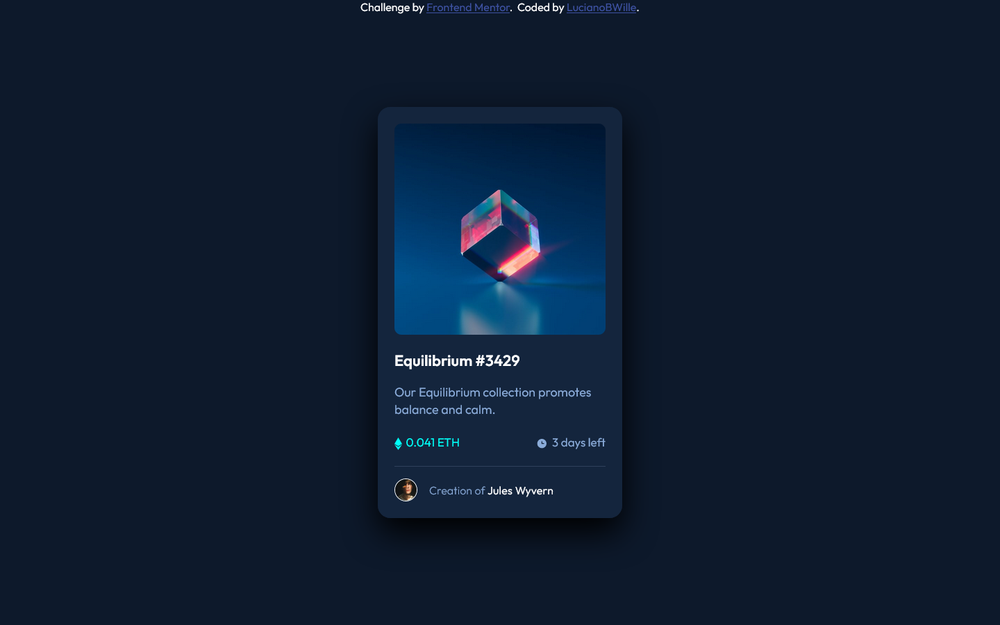
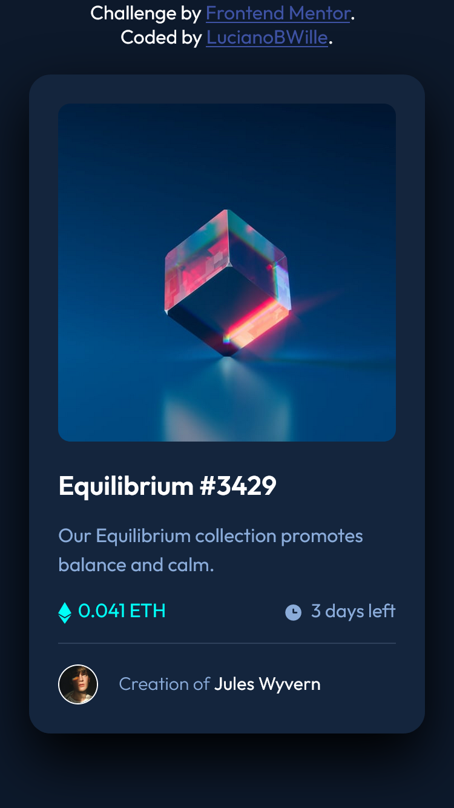

# Frontend Mentor - NFT preview card component solution

This is a solution to the [NFT preview card component challenge on Frontend Mentor](https://www.frontendmentor.io/challenges/nft-preview-card-component-SbdUL_w0U). Frontend Mentor challenges help you improve your coding skills by building realistic projects. 

## Table of contents

- [Frontend Mentor - NFT preview card component solution](#frontend-mentor---nft-preview-card-component-solution)
  - [Table of contents](#table-of-contents)
  - [Overview](#overview)
    - [The challenge](#the-challenge)
    - [Screenshot](#screenshot)
      - [Desktop](#desktop)
      - [Mobile](#mobile)
    - [Links](#links)
  - [My process](#my-process)
    - [Built with](#built-with)
    - [What I learned](#what-i-learned)
    - [Continued development](#continued-development)
  - [Author](#author)

**Note: Delete this note and update the table of contents based on what sections you keep.**

## Overview

### The challenge

Users should be able to:

- View the optimal layout depending on their device's screen size
- See hover states for interactive elements

### Screenshot

#### Desktop

  

#### Mobile

  

### Links

- Solution URL: https://github.com/LucianoBWille/NFT-preview-card-component-FrontendMentorChallenge
- Live Site URL: https://lucianobwille.github.io/NFT-preview-card-component-FrontendMentorChallenge/
- Figma: https://www.figma.com/file/yU58A9gruFZiJnUzLg6mZ2/NFT-preview-card-component-FrontendMentorChallenge?node-id=0%3A1

## My process

### Built with

- Figma Design
- Semantic HTML5 markup
- CSS custom properties
- Flexbox
- Mobile First
- Semantic GIT commits

### What I learned

Improve my skills in Figma, assembling the layout in a much shorter time than before.
I learned a little about semantic commits, assigning an identification tag to the type of operation performed, for example:
- FEAT - Indicates that a new feature is included
- FIX - Indicates that you are solving a problem (bug fix)
- DOCS - indicates a change in documentation (such as README)
- TEST - Indicates a change in tests
- BUILD - For modifying build files and dependencies
- RERF - Indicate code changes related to performance
- STYLE - Indicate code formatting changes, semicolons, trailing spaces, lint...
- CHORE - Indicate update of build tasks, settings, packages... (eg add a package to gitignore)
- CI - Indicate changes related to continuous integration
- REFACTOR - refers to recurring refactoring changes

### Continued development

For future projects I want to try using:
- SASS
- React

## Author

<!-- - Website - [LucianoBWille](https://lucianobwille.github.io/) -->
- LinkedIn - [LucianoBWille](https://www.linkedin.com/in/lucianobwille/)
- Github - [LucianoBWille](https://github.com/LucianoBWille)
- Frontend Mentor - [@LucianoBWille](https://www.frontendmentor.io/profile/LucianoBWille)
